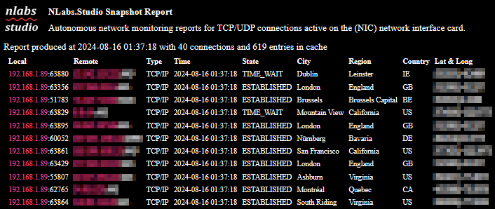

## NLabs Netmonitor Snapshot



Netmonitor snapshot is a report generator which produces readable html documents to outline the active TCP/UDP connections active on host machines. Its a useful utility for network load diagnostics and investigating what connections and ports are being utilised against the host machine.

## Requirements

Netmonitor Snapshot uses python as the primary software technology.

## Dependencies

```
pip install keyboard psutil requests ipaddress
```

## Usage Examples

To invoke Netmonitor snapshot in a commercial setting. You may invoke it using the form where -t implies a token exists for API access from a third party supplier (example: ipinfo.io) for geolocation data requests.

```
python main.py -t XXXXXXXXXXXXXX
```

The optional -f argument exists where a token exists but a non-commercial context exists to comply with the requirements of third party supply chain vendors. That is to kindly comply with their licensing models.

```
python main.py -t XXXXXXXXXXXXXX -f true
```

In order to minimise API requests Netmonitor Snapshot adopts a local disk cache to store lookup records for a maximum of 3-days before a forced update takes place. This minimises the load on third party suppliers and results in the runtime consistently becoming faster the longer the process time of the application increases.

To incur a pause between cycle times, the -m argument specifies the number of minutes to wait before the process resumes into sequential cycles.

```
python main.py -m 3
```

The -mr argument may be used to produce multiple reports and prevent the singleton report being overwritten.

```
python main.py -mr true
```

To perform a single pass and obtain a single report, the -sp argument exists and maybe used via the form:

```
python main.py -sp true
```

## List of Arguments

| Flag | Description                                                          |
|:----:|----------------------------------------------------------------------|
| t    | token key for ipinfo.io web service                                  |
| x    | flush the cache data and export to a comma separated value flat file |
| r    | overrides the global g_refresh_interval setting of 10 seconds        |
| f    | signals a non-commercial use case                                    |
| m    | the number of minutes to wait between each process cycle             |
| mr   | flag to produce multiple instead of a single document report         |
| sp   | flag to undertake a single pass through producing one report         |

## License

Copyright 2024 William Johnson

Permission is hereby granted, free of charge, to any person obtaining a copy of this software and associated documentation files (the "Software"), to deal in the Software without restriction, including without limitation the rights to use, copy, modify, merge, publish, distribute, sublicense, and/or sell copies of the Software, and to permit persons to whom the Software is furnished to do so, subject to the following conditions:

The above copyright notice and this permission notice shall be included in all copies or substantial portions of the Software.

THE SOFTWARE IS PROVIDED "AS IS", WITHOUT WARRANTY OF ANY KIND, EXPRESS OR IMPLIED, INCLUDING BUT NOT LIMITED TO THE WARRANTIES OF MERCHANTABILITY, FITNESS FOR A PARTICULAR PURPOSE AND NONINFRINGEMENT. IN NO EVENT SHALL THE AUTHORS OR COPYRIGHT HOLDERS BE LIABLE FOR ANY CLAIM, DAMAGES OR OTHER LIABILITY, WHETHER IN AN ACTION OF CONTRACT, TORT OR OTHERWISE, ARISING FROM, OUT OF OR IN CONNECTION WITH THE SOFTWARE OR THE USE OR OTHER DEALINGS IN THE SOFTWARE.
